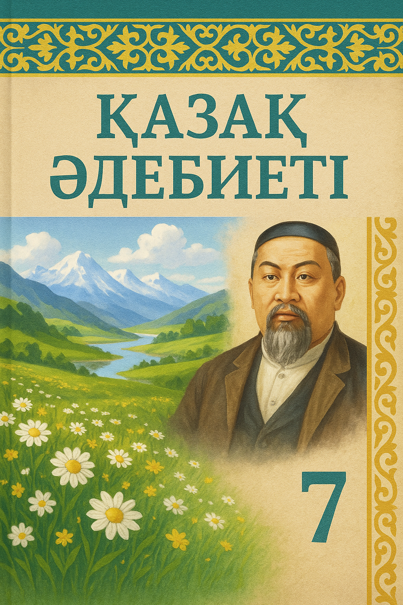

<html lang="kk">
<head>
    <meta charset="UTF-8">
    <meta name="viewport" content="width=device-width, initial-scale=1.0">
    <title>6-сынып қазақ әдебиеті</title>
    
</head>
<body>
    <header>
        <h1>6-сынып қазақ әдебиеті</h1>
        
Оқулық материалдары, аудио-видеолар және тапсырмалар

    </header>
    
    

        

            
        

        
        

            <!-- 1-тарау -->
            

                <h3>1. Қазақ фольклоры</h3>
                
Халықтың ауыз әдебиеті, жырлар, ертегілер, мақал-мәтелдер

                

                    <a href="#" class="media-btn">Аудио оқу</a>
                    <a href="#" class="media-btn">Видео сабақ</a>
                    <a href="#" class="media-btn task-btn">Тапсырмалар</a>
                    <a href="#" class="media-btn download-btn">Жүктеу</a>
                

            

            
            <!-- 2-тарау -->
            

                <h3>2. Ертегілер әлемі</h3>
                
Қазақ халқының дәстүрлі ертегілері, олардың түрлері мен ерекшеліктері

                

                    <a href="#" class="media-btn">Аудио оқу</a>
                    <a href="#" class="media-btn">Видео сабақ</a>
                    <a href="#" class="media-btn task-btn">Тапсырмалар</a>
                    <a href="#" class="media-btn download-btn">Жүктеу</a>
                

            

            
            <!-- 3-тарау -->
            

                <h3>3. Дастандар</h3>
                
"Қозы Көрпеш - Баян сұлу", "Ер Тарғын" сияқты дастандар

                

                    <a href="#" class="media-btn">Аудио оқу</a>
                    <a href="#" class="media-btn">Видео сабақ</a>
                    <a href="#" class="media-btn task-btn">Тапсырмалар</a>
                    <a href="#" class="media-btn download-btn">Жүктеу</a>
                

            

            
            <!-- 4-тарау -->
            

                <h3>4. Ақындар шығармалары</h3>
                
Жамбыл, Абай, Мағжан, Мұқағали шығармалары

                

                    <a href="#" class="media-btn">Аудио оқу</a>
                    <a href="#" class="media-btn">Видео сабақ</a>
                    <a href="#" class="media-btn task-btn">Тапсырмалар</a>
                    <a href="#" class="media-btn download-btn">Жүктеу</a>
                

            

            
            <!-- 5-тарау -->
            

                <h3>5. Қазақ прозасы</h3>
                
М.Әуезов, Ғ.Мүсірепов, С.Мұқанов шығармалары

                

                    <a href="#" class="media-btn">Аудио оқу</a>
                    <a href="#" class="media-btn">Видео сабақ</a>
                    <a href="#" class="media-btn task-btn">Тапсырмалар</a>
                    <a href="#" class="media-btn download-btn">Жүктеу</a>
                

            

            
            <!-- 6-тарау -->
            

                <h3>6. Заманауи қазақ әдебиеті</h3>
                
Қазіргі заманғы қазақ жазушыларының шығармалары

                

                    <a href="#" class="media-btn">Аудио оқу</a>
                    <a href="#" class="media-btn">Видео сабақ</a>
                    <a href="#" class="media-btn task-btn">Тапсырмалар</a>
                    <a href="#" class="media-btn download-btn">Жүктеу</a>
                

            

        

    

    
    <footer>
        
© 2025-26 оқу жылы

        
Қайназарова Жұлдыз Есімханқызы

    </footer>

    
</body>
</html>
